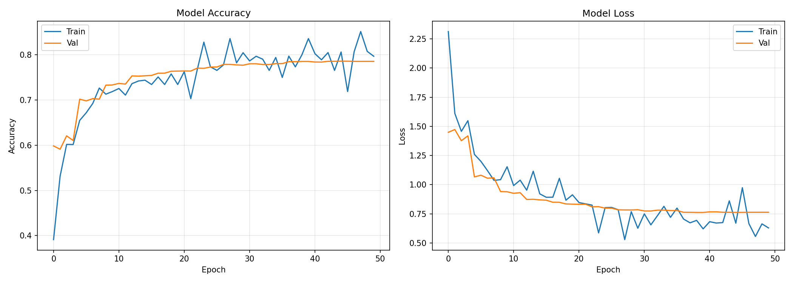

# Neural Zoo - Animal Doodle Classifier

A comprehensive deep learning project for classifying hand-drawn animal doodles. This project implements a custom Deep Convolutional Neural Network (CNN) trained on the Google QuickDraw dataset and deploys the model as a real-time web application using Streamlit and Docker.

**Live Demo:**

- **Streamlit Cloud:** [https://neural-zoo.streamlit.app/](https://neural-zoo.streamlit.app/)
- **Hugging Face Spaces:** [https://huggingface.co/spaces/TheManuAI/neural-zoo](https://huggingface.co/spaces/TheManuAI/neural-zoo)

---

## 1. Problem Description

**Business Context:**  
Recognizing free-hand sketches is a complex Computer Vision problem with applications in education, digital art, and gamification. Unlike natural images (e.g., ImageNet), doodles are abstract, sparse, and suffer from high intra-class variance (everyone draws a "cat" differently).

**Problem Statement:**  
This project aims to classify user drawings into **50 distinct animal categories** in real-time. The challenge is to build a model that is robust to noise, incomplete drawings, and varying stroke styles, running efficiently in a web browser.

**Solution:**  
We developed a custom **Deep CNN** architecture optimized for 28x28 grayscale bitmaps. The solution features a specialized preprocessing pipeline (center-crop-pad) to align user input with the training distribution and is deployed as a containerized web service.

---

## 2. Dataset

The model is trained on the **Google QuickDraw Dataset**, a massive collection of 50 million drawings. We selected a balanced subset of **50 animal classes**.

- **Format**: 28x28 grayscale bitmap images.
- **Classes**: 50 animals (Ant, Bat, Cat, Dog, Elephant, Lion, Panda, Zebra, etc.).
- **Size**: ~750,000 samples used for training/validation (15,000 per class).
- **Source**: [Google QuickDraw Dataset](https://quickdraw.withgoogle.com/data)

---

## 3. Exploratory Data Analysis (EDA)

Extensive EDA was conducted in `EDA-notebook.ipynb` to understand the data characteristics and design the preprocessing pipeline.

**Key Insights:**

- **Sparsity**: Doodles are >90% empty space (black background), requiring models to focus on structural strokes.
- **Class Overlap**: Some classes (e.g., "Bear" vs "Panda", "Horse" vs "Zebra") are visually similar, requiring a deeper network to learn subtle distinguishing features.
- **Preprocessing Criticality**: Raw user input is often off-center. We found that **Bounding Box Centering** is essential to match the QuickDraw data distribution.

---

## 4. Model Training

We experimented with Transfer Learning (MobileNetV2, EfficientNet) but found that a **Custom Deep CNN** performed best for this specific domain of low-resolution abstract art.

**Model Architecture:**

- **Input**: 28x28x1 Grayscale.
- **Backbone**: 4 Convolutional Blocks (64 -> 128 -> 256 -> 512 filters).
- **Neck**: Global Average Pooling (more robust than Flatten).
- **Head**: Dense layers (1024 -> 512) with Batch Normalization and Dropout.
- **Output**: Softmax over 50 classes.

**Training Strategy:**

- **Optimizer**: AdamW.
- **Learning Rate**: Cosine Decay with Warmup.
- **Augmentation**: Rotation, Zoom, Shear, and Shift to simulate drawing variations.
- **Regularization**: Dropout (0.25-0.5), Batch Norm, and L2 Weight Decay.

**Training History:**


_(Fig 1. Training accuracy and loss curves over 50 epochs)_

**Final Metrics:**

- **Validation Accuracy**: **~79.0%** (Top-1)
- **Top-5 Accuracy**: **>94%**
- This performance is near the state-of-the-art for this specific subset of noisy QuickDraw data.

The training logic is exported to `train.py` for reproducibility.

---

## 5. Project Structure

```
.
├── app.py                  # Streamlit web application for real-time inference
├── train.py                # Script to train and save the model (doodle_cnn_best.keras)
├── EDA-notebook.ipynb      # EDA, experiments, and transfer learning attempts
├── requirements.txt        # Python dependencies
├── Pipfile & Pipfile.lock  # Pipenv dependency management
├── Dockerfile              # Docker configuration
├── doodle_cnn_best.keras   # Trained model artifact
├── classes.txt             # List of the 50 animal classes
└── training_history.png    # Training performance plot
```

---

## 6. Installation & Reproducibility

Follow these steps to reproduce the project locally:

**1. Clone the repository:**

```bash
git clone https://github.com/TheManuAI/neural-zoo.git
cd neural-zoo
```

**2. Set up Environment (Pipenv):**

```bash
pip install pipenv
pipenv install
```

_Alternatively, use `pip install -r requirements.txt`_

**3. Usage:**

**Train the Model:**
Run the training script to download data and train from scratch:

```bash
python train.py
```

**Run the App:**

```bash
streamlit run app.py
```

Access the web interface at `http://localhost:8501`.

---

## 7. Containerization

The application is containerized using Docker for consistent deployment across any environment.

**Build Image:**

```bash
docker build -t neural-zoo .
```

**Run Container:**

```bash
# Using host networking (simplest for Linux)
docker run --net=host neural-zoo

# OR using standard port mapping
docker run -p 8501:8501 neural-zoo
```

The app will be available at `http://localhost:8501`.

---

## 8. Cloud Deployment

The project is deployed and live on the following platforms:

- **Streamlit Cloud**: [https://neural-zoo.streamlit.app/](https://neural-zoo.streamlit.app/)
- **Hugging Face Spaces**: [https://huggingface.co/spaces/TheManuAI/neural-zoo](https://huggingface.co/spaces/TheManuAI/neural-zoo)

---

## Results Summary

| Model Approach                  | Input Size | Val Accuracy | Status                   |
| :------------------------------ | :--------- | :----------- | :----------------------- |
| Transfer Learning (MobileNetV2) | 32x32      | ~40%         | Failed (Domain Mismatch) |
| Shallow CNN                     | 28x28      | ~72%         | Baseline                 |
| **Deep Custom CNN**             | **28x28**  | **~79%**     | **Selected**             |

The final **Deep Custom CNN** provides the best balance of accuracy and inference speed (<100ms), making it ideal for the real-time interactive drawing app.
