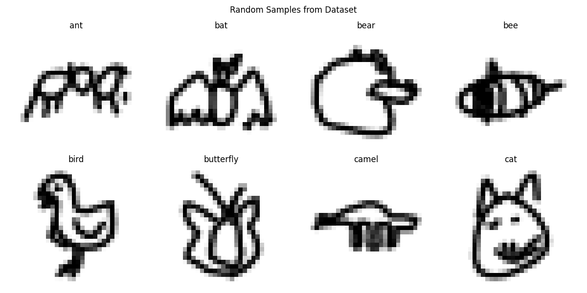
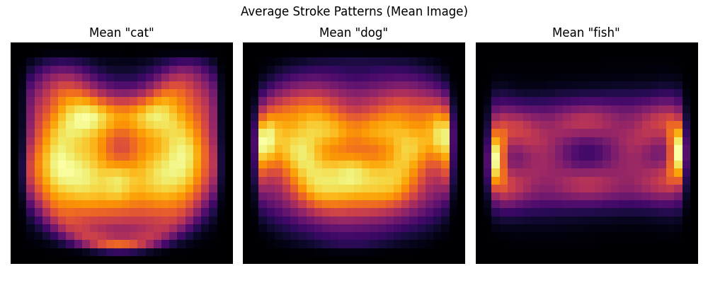

# Neural Zoo - Animal Doodle Classifier

A machine learning project that classifies hand-drawn animal doodles. I built this custom Convolutional Neural Network (CNN) using the Google QuickDraw dataset and deployed it as a real-time web app.

**Live Demo:**

- **Streamlit Cloud:** [https://neural-zoo.streamlit.app/](https://neural-zoo.streamlit.app/)
- **Hugging Face Spaces:** [https://huggingface.co/spaces/TheManuAI/neural-zoo](https://huggingface.co/spaces/TheManuAI/neural-zoo)

---

## 1. Problem Description

**Context:**  
Recognizing free-hand sketches is a unique computer vision challenge. Doodles are abstract, often incomplete, and vary significantly between individuals. Unlike typical photo classification, the data here is sparse (lines on a blank background).

**Problem Statement:**  
My objective was to classify user drawings into **50 distinct animal categories** in real-time. The system needed to be robust enough to handle different drawing styles and messy inputs while running efficiently in a browser environment.

**Solution:**  
I developed a **Deep CNN** trained on 28x28 grayscale bitmaps. A key part of the solution is the preprocessing pipeline, which I designed to center and scale user input to match the training data distribution, ensuring consistent predictions.

---

## 2. Dataset

The training data comes from the **Google QuickDraw Dataset**, specifically a balanced subset of 50 animal classes.

- **Format**: 28x28 grayscale bitmaps.
- **Classes**: 50 animals (e.g., Cat, Dog, Elephant, Panda, Zebra).
- **Size**: ~750,000 samples total (15,000 per class used for training).
- **Source**: [Google QuickDraw Dataset](https://quickdraw.withgoogle.com/data)

Here is a glimpse of the random samples from the dataset:


---

## 3. Exploratory Data Analysis (EDA)

I conducted extensive analysis in `EDA-notebook.ipynb` to understand the data structure.

**Key Insights:**

- **Sparsity**: Most pixels in the images are zero. Models need to focus purely on structural strokes.
- **Average Shapes**: By averaging thousands of images, I could see the "canonical" shape for each animal (e.g., the face shape of a cat vs. dog).



- **Alignment**: The original QuickDraw data is centered. I found that if I didn't center the user's input in the app, the model failed. This led to the bounding-box preprocessing step in `app.py`.

---

## 4. Model Training

Initial experiments with Transfer Learning (MobileNetV2) did not yield good results due to the small resolution (28x28) and domain mismatch. I decided to build a **Custom Deep CNN** from scratch.

**Model Architecture:**

- **Input**: 28x28x1 Grayscale.
- **Structure**: 4 Convolutional blocks (64 to 512 filters).
- **Regularization**: I used Batch Normalization and Dropout extensively to prevent overfitting.

**Training Configuration:**

- **Optimizer**: AdamW.
- **Learning Rate**: Cosine Decay schedule with a warmup period.
- **Augmentation**: Random rotation, shift, and zoom to simulate variations in user drawings.

**Results:**

- **Validation Accuracy**: **~79%** (Top-1)
- **Top-5 Accuracy**: **>94%**

**Training History:**

_(Fig: Training accuracy and loss curves over 50 epochs)_

All training logic is exported to `train.py`.

---

## 5. Project Structure

```
.
├── app.py                  # Streamlit application code
├── train.py                # Model training script
├── EDA-notebook.ipynb      # Analysis and experiments
├── requirements.txt        # Project dependencies
├── Dockerfile              # Docker container configuration
├── visualization/          # Plots and images
├── doodle_cnn_best.keras   # Trained model artifact
└── classes.txt             # List of supported animal classes
```

---

## 6. Installation

To run the project locally:

1.  **Clone the repository:**

    ```bash
    git clone https://github.com/TheManuAI/neural-zoo.git
    cd neural-zoo
    ```

2.  **Install dependencies:**

    ```bash
    pip install -r requirements.txt
    ```

3.  **Run the application:**
    ```bash
    streamlit run app.py
    ```
    The app will open at `http://localhost:8501`.

---

## 7. Containerization

I included a `Dockerfile` to ensure the application runs consistently across different environments.

**Build:**

```bash
docker build -t neural-zoo .
```

**Run:**

```bash
docker run -p 8501:8501 neural-zoo
```

---

## 8. Deployment

The application is deployed on multiple cloud platforms for redundancy:

**1. Streamlit Cloud:**

- **URL**: [https://neural-zoo.streamlit.app/](https://neural-zoo.streamlit.app/)

**2. Hugging Face Spaces:**

- **URL**: [https://huggingface.co/spaces/TheManuAI/neural-zoo](https://huggingface.co/spaces/TheManuAI/neural-zoo)

---

## Performance Summary

| Approach                      | Accuracy | Notes                                                   |
| :---------------------------- | :------- | :------------------------------------------------------ |
| Transfer Learning (MobileNet) | 40%      | Failed due to input size/domain mismatch.               |
| **Custom Deep CNN**           | **79%**  | **Selected model. Best balance of speed and accuracy.** |

My final model offers sub-100ms inference times, making it suitable for real-time interaction.
